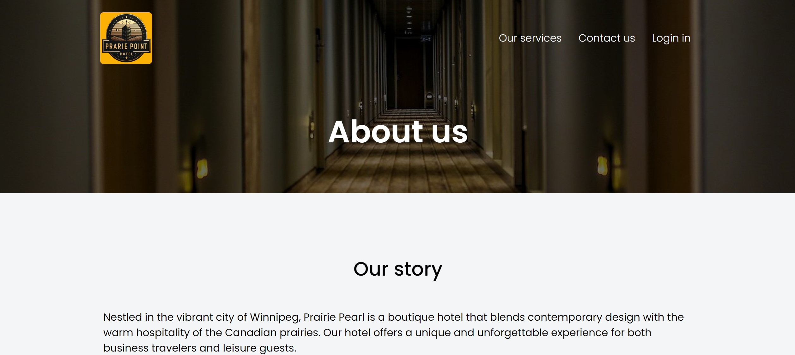
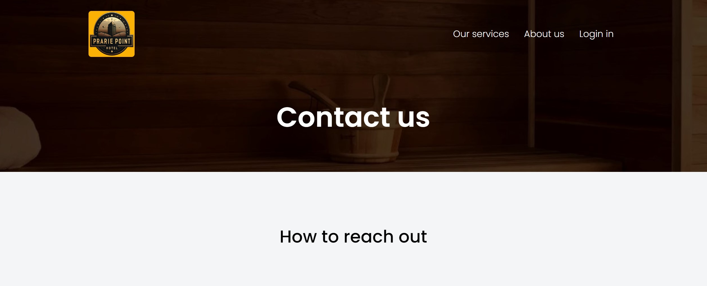

# Prairie Point Hotel


<br>
[Prairie Point Hotel](https://fabianmendozaospina.github.io/prairie-point-hotel/) is a simple example of a learning project built in `HTML 5`, and `CSS 3`. It will later incorporate some functionalities in `JavaScript` (ECMA Script 6). This website was designed following good programming practices.

## Features

- Use of semantic HTML tags.
- Use of hero-banner.
- Use of responsive web layout, through:
    - Flexbox: A one-dimensional layout method for aligning items along rows or columns.
    - Grid: A two-dimensional layout method for creating grid-based layouts with rows and columns.
    - Media Queries: CSS rules that apply styles based on the device characteristics like screen width.

## Get Started

To get started locally:

1. Clone this repo:
   ```bash
   git clone https://github.com/fabianmendozaospina/prairie-point-hotel.git
   cd prairie-point-hotel
   ```
1. Explore the different files.
1. Select the index.html file.
1. Do right-click and select the `Reveal in File Explorer` menu.
1. Double-click on file index.html.
1. The browser will show the starting web page:

   

7. Through the top menu, you can navegate to the other web pages, such as `About us` and `Contact us`:

   

   


