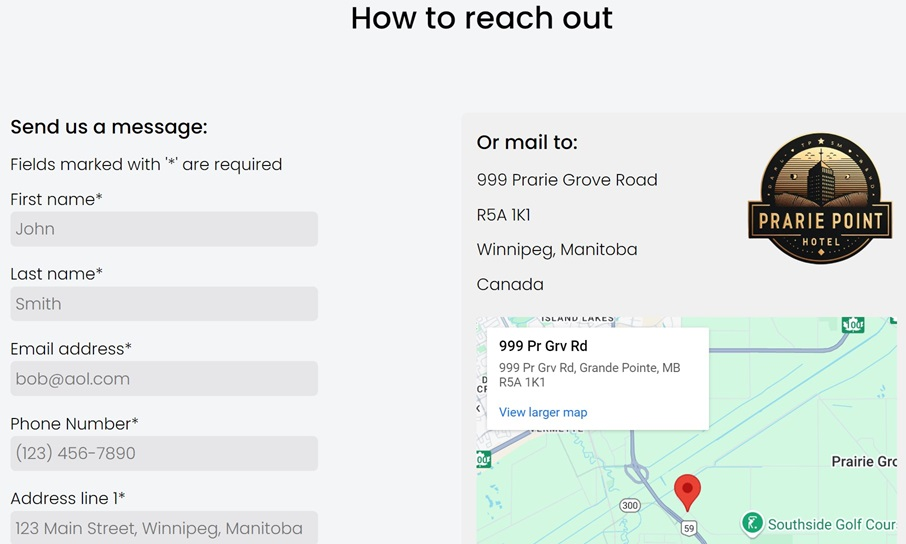

# Prairie Point Hotel


<br>
[Prairie Point Hotel](https://fabianmendozaospina.github.io/prairie-point-hotel/) is a learning project developed with `HTML5` and `CSS3`, demonstrating core web design principles. The project follows best coding practices and will be expanded with `JavaScript (ES6)` for added interactivity and functionality. It's designed to showcase clean structure, responsive design, and modern web standards.

## Features

[Prairie Point Hotel](https://fabianmendozaospina.github.io/prairie-point-hotel/) website is designed to showcase modern web development techniques, ensuring both aesthetic appeal and functional responsiveness. Built using best practices in `HTML5` and `CSS3`, the project emphasizes clean, accessible code and flexible layouts that adapt seamlessly across devices. The following features highlight key aspects of the design:

- Use of semantic HTML tags for better structure and accessibility.
- Implementation of a hero-banner for visually engaging design.
- A responsive web layout through the use of:
    - Flexbox: A one-dimensional layout system to align items in rows or columns.
    - Grid: A two-dimensional layout system for creating complex, grid-based layouts.
    - Media Queries: CSS rules that adapt the design based on device characteristics, such as screen width.

## Get Started

To get started locally:

1. Clone this repo:
   ```bash
   git clone https://github.com/fabianmendozaospina/prairie-point-hotel.git
   cd prairie-point-hotel
   ```
1. Explore the different files.
1. Select the index.html file.
1. Do right-click and select the `Reveal in File Explorer` menu.
1. Double-click on file index.html.
1. The browser will show the starting web page:

   

7. Through the top menu, you can navegate to the other web pages, such as `About us` and `Contact us`:

   

   


